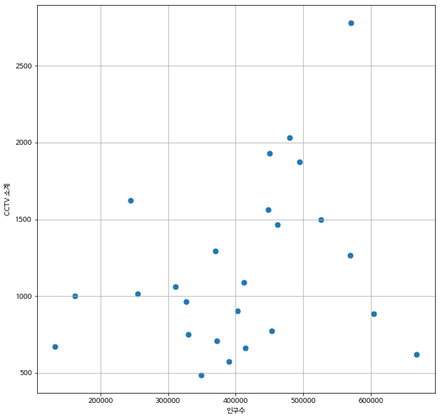
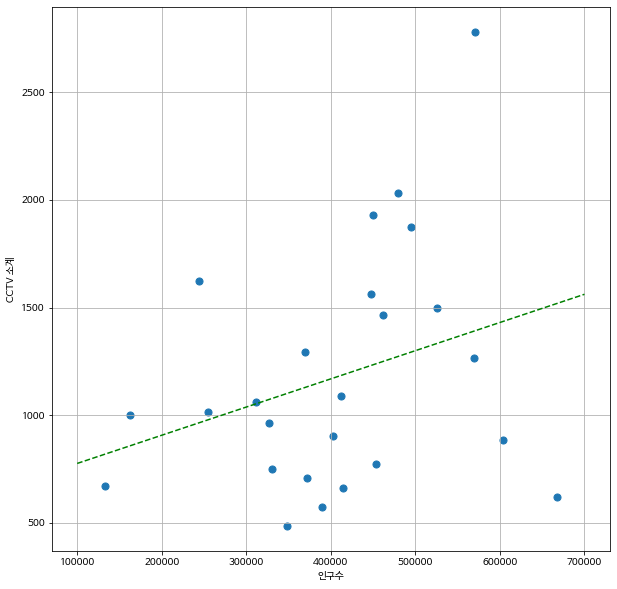

# 1.서울시 CCTV 데이터 분석


## 가설

인구수가 많은 자치구 일수록 범죄의 위험이 늘어날테니 CCTV의 갯수도 더 많을것이다.


 ## 데이터 불러오기


#### 1.CCTV 데이터 불러오고 다듬기

```python
CCTV_FILE = '01. CCTV_in_Seoul.csv'
POP_FILE = '01. population_in_Seoul.xls'

import pandas as pd

df_cctv = pd.read_csv(CCTV_FILE)
df_cctv.head()
```

**일단 cctv 데이터프레임을 먼저 확인한다.**


위 사진처럼 cctv 데이터 프레임이 잘 출력되었다. 근데 자치구 컬럼의 컬럼명이 `기관명`으로 되어있다. 컬럼이름을 재설정해준다.

```python
df_cctv = df_cctv.rename(
    columns={'기관명' : '구별'}
)
df_cctv.head()
```


데이터프레임에 `NAN`값이 있는지 확인해준다.

```python
df_cctv.info()
```

```python
<class 'pandas.core.frame.DataFrame'>
RangeIndex: 25 entries, 0 to 24
Data columns (total 6 columns):
 #   Column     Non-Null Count  Dtype 
---  ------     --------------  ----- 
 0   기관명        25 non-null     object
 1   소계         25 non-null     int64 
 2   2013년도 이전  25 non-null     int64 
 3   2014년      25 non-null     int64 
 4   2015년      25 non-null     int64 
 5   2016년      25 non-null     int64 
dtypes: int64(5), object(1)
memory usage: 1.3+ KB
```

`NAN`값이 없으니 이대로 진행해준다.


#### 2.서울시 인구수 데이터를 가져오고 다듬기

이제 서울시의 인구수 데이터 시트를 가져올껀데 엑셀파일형식이라 colab에선 엑셀을 불러오는 버전이 낮아서 오류가 뜨니 버전 업그레이드 후에 엑셀파일을 불러온다.

```python
!pip install xlrd==1.2.0
df_pop_seoul = pd.read_excel(POP_FILE)
df_pop_seoul.head()
```


필요한 데이터는 자치구별로 총 인원수. 즉, 합계만 필요하나 남자,여자 성별로 구분된 인구수의 데이터는 필요없으니 다듬어주고 **자치구(B),인구수 총합계(D), 한국인수 총합계(G), 외국인수 총합계(J), 65세이상 고령자의 총합계(N)**의 시리즈들만 가져오고 나머지는 지워준다.


```python
df_pop_seoul=pd.read_excel(
    POP_FILE,
    header=2,
    usecols='B,D,G,J,N'
)
df_pop_seoul.head()
```


**보기쉽게 컬럼명을 변경해준다.**

```python
df_pop_seoul.columns = ['구별','인구수','한국인','외국인','고령자']
df_pop_seoul.head()
```


0번째 `합계` 행은 필요없는 행이니 지워준다. `drop` 함수를 이용한다.

```python
df_pop_seoul=df_pop_seoul.drop(0,axis=0)
df_pop_seoul.head()
```


데이터프레임에 `NAN` 값이 없는지 확인해준다.

```python
df_pop_seoul.info()
```

```python
<class 'pandas.core.frame.DataFrame'>
Int64Index: 26 entries, 1 to 26
Data columns (total 5 columns):
 #   Column  Non-Null Count  Dtype  
---  ------  --------------  -----  
 0   구별      25 non-null     object 
 1   인구수     25 non-null     float64
 2   한국인     25 non-null     float64
 3   외국인     25 non-null     float64
 4   고령자     25 non-null     float64
dtypes: float64(4), object(1)
memory usage: 1.2+ KB
```


모든 컬럼마다 `NAN` 값이 한개씩 있는걸 보니 하나의 행 전체가 다 `NAN` 값일 가능성이 높아보인다. 확인해보면

```python
df_pop_seoul[df_pop_seoul['구별'].isnull()]
```


26번 행이 `NAN` 값으로만 채워진걸 확인할수있다. `NAN` 값으로 채워진 데이터는 의미없는 데이터이니 지워준다. `dropna` 함수를 이용한다.

```python
df_pop_seoul=df_pop_seoul.dropna(axis=0)
df_pop_seoul.isnull().sum()
```

```python
구별     0
인구수    0
한국인    0
외국인    0
고령자    0
dtype: int64
```


#### 3.의미있을것같은 데이터를 데이터프레임에 추가해준다


+ **CCTV 데이터**

cctv 데이터프레임의 비교적 최근 데이터인 **2014, 2015, 2016** 이렇게 3년치의 cctv 증가 정도가 **2013년 이전** 에 비해 얼만큼 증가했는지 **증가율**을 구해준다.

```python
df_cctv['최근증가율'] = (df_cctv['2014년'] + df_cctv['2015년'] +df_cctv['2016년']) /df_cctv['2013년도 이전'] *100

df_cctv.sort_values(by='최근증가율', ascending=False).head()
```


**증가율**을 구한후 증가율을 기준으로 **내림차순** 으로 정렬한다.


+ **서울시 인구수 데이터**

외국인과 고령자가 cctv의 증가율과 상관관계가 있을 가능성도 배제할순 없으니 **외국인 비율** 과 **고령자 비율** 을 구해서 데이터프레임에 추가시켜준다.

```python
df_pop_seoul['외국인비율']=df_pop_seoul['외국인']/df_pop_seoul['인구수']*100
df_pop_seoul['고령자비율']=df_pop_seoul['고령자']/df_pop_seoul['인구수']*100
df_pop_seoul.head()
```


#### 4. CCTV 데이터프레임과 서울시인구수 데이터프레임을 병합시켜준다

두 데이터프레임에서 겹치는 **키**는 **''구별''** 키이다. "구별"키를 이용해서 병합시켜준다.

```python
data_result=pd.merge(df_cctv, df_pop_seoul, on='구별', how='inner')
data_result.head()
```


최근증가율도 구해놨고 병합도 했으니 이젠 cctv 데이터프레임의 **2013 이전, 2014, 2015, 2016**년 시리즈 데이터들은 필요없으니 지워준다.

```python
del data_result['2013년도 이전']
del data_result['2014년']
del data_result['2015년']
del data_result['2016년']

data_result.head()
```


## 데이터 살펴보기

#### 상관관계

+ **고령자 비율과 cctv 소계의 상관관계**

```python
import numpy as np
np.corrcoef(data_result['고령자비율'],data_result['소계'])
```

결과

```python
array([[ 1.        , -0.28078554],
       [-0.28078554,  1.        ]])
```


+ **외국인 비율과 cctv 소계의 상관관계**

```python
np.corrcoef(data_result['외국인비율'],data_result['소계'])
```

결과

```python
array([[ 1.        , -0.13607433],
       [-0.13607433,  1.        ]])
```


+ **자치구별 인구수와 cctv 소계의 상관관계**

```python
np.corrcoef(data_result['인구수'],data_result['소계'])
```

결과

```python
array([[1.        , 0.30634228],
       [0.30634228, 1.        ]])
```


<u>결론: 지금 상황에선 인구수와 cctv 소계간의 상관관계가 제일 높게 나왔으니 인구수로 분석을 하는게  합리적인 방향이다.</u>


#### 상관관계 결론을 토대로 시각화를 진행한다.


## 시각화 하기

**초기설정**

```python
!sudo apt-get install -y fonts-nanum
!sudo fc-cache -fv
!rm ~/.cache/matplotlib -rf

import matplotlib.pyplot as plt
plt.rc('font', family='NanumBarunGothic')
import seaborn as sns
```


**인구수 대비 cctv의 소계를 시각화로 확인하고 싶으니 산점도를 이용하여 확인한다.**

```python
plt.figure(figsize=(10,10))
plt.scatter(data_result['인구수'],data_result['소계'], s=50)
plt.xlabel('인구수')
plt.ylabel('CCTV 소계')
plt.grid()
plt.show()
```




**인구수와 cctv 소계의 증가추세를 직선으로 그려서 확인하면 더욱 보기 편할거같다.**

```python
fp1= np.polyfit(data_result['인구수'],data_result['소계'], 1)
f1 = np.poly1d(fp1) 
fx = np.linspace(100000,700000,100)

plt.figure(figsize=(10,10))
plt.scatter(data_result['인구수'],data_result['소계'], s=50)
line = f1(fx) #직선
plt.plot(fx, line, color='g', linestyle='--')
plt.xlabel('인구수')
plt.ylabel('CCTV 소계')
plt.grid()
plt.show()
```




*****

