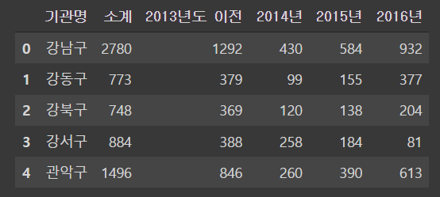
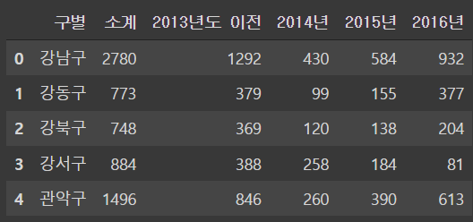

# 1.서울시 CCTV 데이터 분석


## 가설

인구수가 많은 자치구 일수록 범죄의 위험이 늘어날테니 CCTV의 갯수도 더 많을것이다.


 ## 데이터 불러오기

**1. cctv 데이터 불러오고 데이터시트 다듬기**

```python
CCTV_FILE = '01. CCTV_in_Seoul.csv'
POP_FILE = '01. population_in_Seoul.xls'

import pandas as pd

df_cctv = pd.read_csv(CCTV_FILE)
df_cctv.head()
```

**일단 cctv 데이터시트를 먼저 확인한다**




위 사진처럼 cctv 데이터 시트가 잘 출력되었다. 근데 자치구 컬럼의 컬럼명이 `기관명`으로 되어있다. 컬럼이름을 재설정해준다.

```python
df_cctv = df_cctv.rename(
    columns={'기관명' : '구별'}
)
df_cctv.head()
```





**2. 서울시 인구수 데이터 시트를 가져오고 다듬기**

이제 서울시의 인구수 데이터 시트를 가져올껀데 엑셀파일형식이라 colab에선 엑셀을 불러오는 버전이 낮아서 오류가 뜨니 버전 업그레이드 후에 엑셀파일을 불러온다.

```python
!pip install xlrd==1.2.0
df_pop_seoul = pd.read_excel(POP_FILE)
df_pop_seoul.head()
```